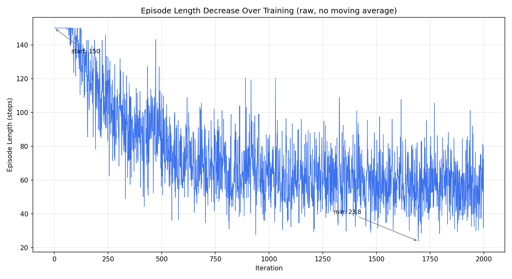
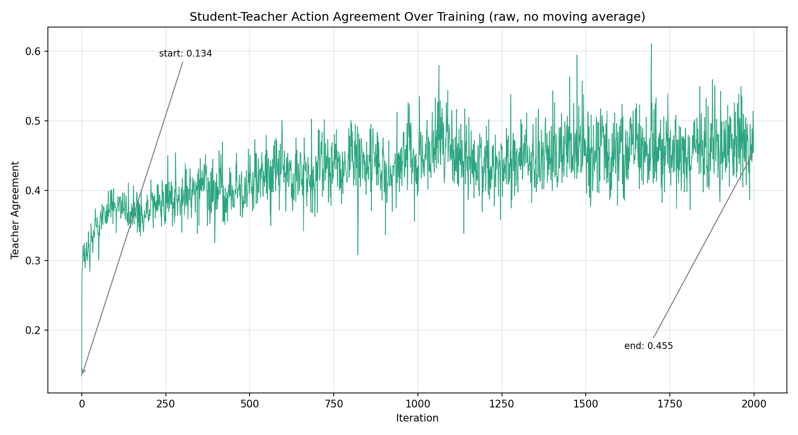
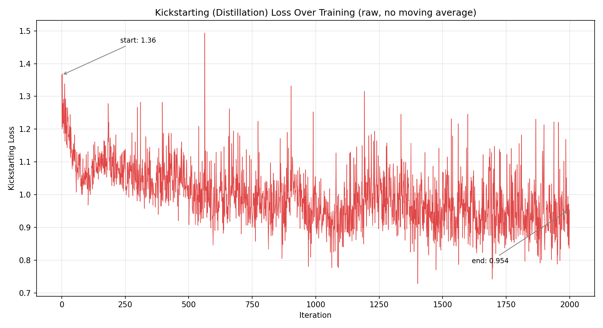
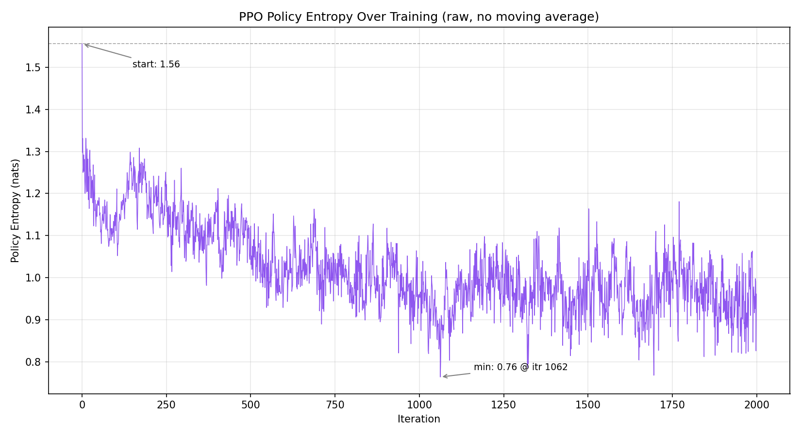

[](https://github.com/parthj732005/llm4teach-reflection/actions/workflows/python.yml)
[](LICENSE)

# LLM4Teach — Large Language Models as Policy Teachers for RL Agents

An implementation and experimental extension of the IJCAI 2024 paper  
**"[Large Language Model as a Policy Teacher for Training Reinforcement Learning Agents](https://arxiv.org/abs/2311.13373)"**

Trained on **Kaggle (Tesla T4 GPU)** using **Qwen 2.5:3b** via Ollama as the LLM teacher.

The original [LLM4Teach (IJCAI 2024)](https://arxiv.org/abs/2311.13373) by Zhou et al. introduced a policy distillation framework where an LLM teacher provides soft action distributions to guide a PPO student via a kickstarting loss, with teacher influence gradually decayed as the student matures.

This repository extends that work with three contributions:
- **Episode-level reflection memory** — after each episode, Qwen 2.5:3b reflects on what went wrong; reflections are stored and retrieved to improve future plans
- **Confidence-based cache invalidation** — the planner tracks per-state failure counts and discards stale plans when the agent repeatedly fails on the same symbolic state
- **Dynamic entropy protection in PPO** — entropy bonus is scaled 2×/3× automatically when the policy starts to collapse, preventing premature convergence

A 3-phase ablation (PPO / PPO+Planner / PPO+Reflection) is run on the `simpledoorkey` MiniGrid task, trained on Kaggle (Tesla T4).

---

## What This Project Does

Standard RL agents learn purely from sparse rewards — they fail thousands of times before discovering the goal. LLM4Teach fixes this by pairing a **student PPO agent** with an **LLM teacher (Qwen)** that provides symbolic guidance during training.

```
┌─────────────────────────────────────────────────────────────────┐
│  LLM Teacher (Qwen 2.5:3b via Ollama)                          │
│  ├── Generates symbolic plans: "go to key → pick up → open door"│
│  ├── Detects when student is stuck and intervenes              │
│  └── Reflects on failure episodes to improve future plans      │
└───────────────────────┬─────────────────────────────────────────┘
                        │  kickstarting signal (KL loss)
                        ▼
┌─────────────────────────────────────────────────────────────────┐
│  PPO Student (Neural Network)                                   │
│  ├── Executes low-level actions: move, turn, pick up, toggle   │
│  ├── Learns from sparse env reward + teacher's action dist.    │
│  └── Gradually learns to solve tasks independently             │
└───────────────────────┬─────────────────────────────────────────┘
                        │  actions
                        ▼
┌─────────────────────────────────────────────────────────────────┐
│  MiniGrid Environment (simpledoorkey)                           │
│  └── Sparse reward: agent must find key, open door, reach goal │
└─────────────────────────────────────────────────────────────────┘
```

---

## 3-Phase Ablation Design

The experiment isolates each component's contribution across 3 phases:

| Phase | Name | What's added | Iterations |
|---|---|---|---|
| **1** | `ppo_only` | Pure PPO — no teacher, no kickstarting | 200 |
| **2** | `planner` | + LLM teacher + kickstarting loss | 200 |
| **3** | `reflection` | + Episode reflections + memory retrieval | 2000 |

**Phase 1** establishes the baseline: can PPO learn alone?  
**Phase 2** adds the LLM teacher's symbolic plans as a training signal.  
**Phase 3** adds reflection — after each episode the LLM reflects on what went wrong, stores it in memory, and retrieves relevant failures to improve future plans.

### Component flags per phase

| Flag | Phase 1 | Phase 2 | Phase 3 |
|---|:---:|:---:|:---:|
| `use_teacher_policy` | ✗ | ✓ | ✓ |
| `use_planner` | ✗ | ✓ | ✓ |
| `use_kickstarting` | ✗ | ✓ | ✓ |
| `use_reflection` | ✗ | ✗ | ✓ |
| `use_episode_memory` | ✗ | ✗ | ✓ |

---

## Training Results (from `logs/`)

Environment: **simpledoorkey** | Hardware: **Tesla T4 (Kaggle)** | LLM: **Qwen 2.5:3b**

### Phase 1 — PPO Only (200 iterations)

| Metric | Value |
|---|---|
| Avg success rate | **0.7%** |
| Best success rate (single itr) | 20% |
| Avg episode length | 149.6 / 150 steps (hitting timeout) |
| Avg reward | 0.003 |
| Policy entropy | 1.90 (highly random — not learning) |

PPO alone fails entirely on this task in 200 iterations. Episode length stays at the maximum of 150 — the agent wanders randomly, never finding the goal.

### Phase 3 — PPO + Planner + Reflection (2000 iterations)

**Success rate progression across training:**

| Iteration window | Avg success rate | Avg episode length |
|---|---|---|
| 0 – 99 (cold start) | 3.1% | 148 steps |
| 100 – 499 | 58.2% | — |
| 500 – 999 | 84.2% | 69 steps |
| 1000 – 1499 | 88.6% | — |
| 1500 – 1999 | **89.6%** | **57.7 steps** |

**Final held-out evaluation** (20 episodes):

| Metric | Value |
|---|---|
| Student (PPO) success rate | 35% |
| Teacher (LLM) success rate | 50% |
| Student–teacher gap | −15 pp |
| Avg reward | 0.301 |
| Avg episode length | 105.6 steps |

**LLM / planner internals:**

| Metric | Value |
|---|---|
| Planner cache hit rate | 99.96% |
| Total LLM reflections generated | ~14.3 M |
| Total memory retrievals | ~654 K |
| Total teacher interventions | ~6.2 M |
| Unique symbolic states seen | 6 |
| Kickstarting coefficient | 0.15 (stable) |

### Key plots






---

## Metric Glossary

Every metric logged during training, explained:

| Metric | What it measures | What to look for |
|---|---|---|
| **success_rate** | Fraction of episodes in the current iteration where the agent reached the goal | Rising trend = learning |
| **average_reward** | Mean cumulative reward per episode per iteration. Sparse: 1.0 = success, 0.0 = fail | Should correlate with success_rate |
| **episode_length** | Average number of steps per episode | Decreasing = agent finds goal faster; stuck at max (150) = not learning |
| **entropy** | Shannon entropy of the PPO policy's action distribution. High = exploratory/random, low = confident/deterministic | Should decrease as agent converges |
| **teacher_agreement** | Fraction of steps where PPO picks the same action as the LLM teacher | Tells you how much the student is imitating the teacher |
| **kickstarting_coef** (ks_coef) | Weight on the kickstarting KL loss added to PPO gradient. Set by schedule | Decay means teacher influence reducing as student matures |
| **ks_loss** | KL divergence between PPO's action distribution and teacher's action distribution, weighted by ks_coef | Drops as student distribution approaches teacher |
| **interventions** | Number of times the failure detector triggered and teacher took over mid-episode | High early, should reduce as student learns to avoid failure states |
| **planner_calls** | Total calls to the symbolic planner (cached + online) | High number is normal — one call per step |
| **cache_hit_rate** | Fraction of planner calls answered from cache (pre-computed or previously seen) | ~99.96% here — LLM rarely queried live; offline plans dominate |
| **cache_invalidations** | Times a cached plan was discarded after repeated failures on the same state | More invalidations = planner adapting more aggressively |
| **reflections_generated** | Episode-level LLM reflections produced (one per episode by the reflector) | Should scale with training iterations |
| **memory_retrievals** | How many times reflection memory was queried to inject context into the planner prompt | Increasing = memory being used |
| **online_success** | LLM calls that returned a valid parseable plan (vs fallback) | Low here because cache dominates |
| **teacher_requested_pickup / toggle** | How often teacher instructed a pickup or door-toggle action | Diagnostic for teacher instruction quality |
| **ep_reached_goal / ep_opened_door** | Per-episode binary: did agent open the door / reach the goal | Granular sub-task completion tracking |
| **unique_symbolic_states_seen** | Number of distinct observation states the planner has ever seen | 6 here = task has a small symbolic state space |

---

## Project Structure

```
LLM4Teach/
│
├── LLM4Teach_Kaggle_Research.ipynb  ← Main notebook (run this on Kaggle)
│
├── main.py                     # CLI entry point (train / eval one phase)
├── Game.py                     # Training loop: collect rollouts, PPO update, logging
├── experiment_runner.py        # build_game(), run_phase(), run_research_pipeline()
├── experiment_config.py        # ExperimentConfig — all component flags in one place
├── planner.py                  # LLM symbolic planner with cache + confidence decay
├── mediator.py                 # RL ↔ LLM state and action translation
├── teacher_policy.py           # Teacher: skill dispatch + failure detection
│
├── algos/                      # RL algorithm
│   ├── ppo.py                  # PPO with kickstarting loss
│   ├── buffer.py               # Rollout buffer (obs, actions, teacher_probs, returns)
│   └── model.py                # Actor-critic network (MLP)
│
├── env/                        # Custom MiniGrid environments
│   ├── doorkey.py              # SimpleDoorKey
│   ├── coloreddoorkey.py       # ColoredDoorKey variant
│   ├── lavadoorkey.py          # LavaDoorKey variant
│   └── historicalobs.py        # Observation history wrapper
│
├── memory/                     # Memory and reflection system
│   ├── reflection.py           # Episode-level LLM reflection generator
│   └── memory_buffer.py        # Episodic + state memory store with retrieval
│
├── skill/                      # Primitive skill library (teacher uses these)
│   ├── explore.py              # Random exploration skill
│   └── goto_goal.py            # Goal navigation skill
│
├── utils/
│   ├── qwen_llm.py             # Qwen API wrapper (Ollama + offline fallback)
│   └── symbolic_parser.py      # Parses LLM plan strings into skill sequences
│
├── prompt/
│   └── task_info.json          # Task descriptions fed to the LLM teacher
│
├── tests/                      # Unit tests (no GPU or Ollama required)
│   ├── test_failure_detector.py
│   ├── test_reflection_memory.py
│   ├── test_experiment_config.py
│   ├── test_episode_trajectory.py
│   ├── test_symbolic_parser.py
│   └── test_reflection_validation.py
│
├── logs/                       # Phase 3 training logs (metrics, history, LLM stats)
├── screenshots/                # Training curve screenshots
│
├── generate_report.py          # Generate result plots from training logs
├── generate_report_v2.py       # Extended report generator
├── LLM4Teach_Report_v2.pdf     # Full research report
├── LLM4Teach_Technical_Report.pdf
│
├── .github/workflows/python.yml  # CI — runs tests on every push
├── docker/                     # Docker setup for reproducibility
├── requirements.txt
├── LICENSE
├── CONTRIBUTING.md
├── setup.sh / setup.bat        # Local setup (Linux / Windows)
├── kaggle_setup.sh             # Kaggle-specific dependency setup
└── run_train.sh / run_train.bat  # Launch training from CLI
```

---

## Running the Experiment

### Kaggle (recommended — Tesla T4, all dependencies pre-installed)

1. Zip this repo and upload as a Kaggle Dataset
2. Open `LLM4Teach_Kaggle_Research.ipynb`
3. Add the dataset as input at `/kaggle/input/llm4teach/`
4. In **Cell 3**, set:
   ```python
   TASK = 'simpledoorkey'
   EXPERIMENT = 'reflection'          # or 'ppo_only' / 'planner'
   RUN_RESEARCH_PIPELINE = True       # runs all 3 phases sequentially
   QWEN_BACKEND = 'ollama'            # auto-installs Ollama + pulls qwen2.5:3b
   ```
5. Run all cells — results save to `/kaggle/working/results/`

### Local (Linux / Mac)

```bash
bash setup.sh
bash run_train.sh
```

### Local (Windows)

```bat
setup.bat
run_train.bat
```

### Docker

```bash
docker-compose up
```

---

## Configuration

All component toggles live in `experiment_config.py` — no source edits needed between runs:

```python
from experiment_config import ExperimentConfig

# Phase 1: PPO only
cfg = ExperimentConfig(use_planner=False, use_reflection=False, total_iterations=200)

# Phase 2: + planner + kickstarting
cfg = ExperimentConfig(use_planner=True, use_kickstarting=True, total_iterations=200)

# Phase 3: + reflection memory
cfg = ExperimentConfig(use_planner=True, use_kickstarting=True,
                       use_reflection=True, use_episode_memory=True,
                       total_iterations=2000)
```

---

## Dependencies

- Python 3.10+, PyTorch 2.x
- `minigrid==3.1.0`, `gymnasium==1.3.0`
- Ollama + `qwen2.5:3b` (or set `QWEN_BACKEND='offline'` to skip LLM)
- See [`requirements.txt`](requirements.txt) for full list

---

## Tests

Unit tests cover the core deterministic components — no GPU, no Ollama, no internet required.

```bash
pip install pytest numpy
pytest tests/ -v
```

| Test file | What it covers |
|---|---|
| `test_failure_detector.py` | Stuck, oscillation, failed interaction, lava death detection |
| `test_reflection_memory.py` | Deduplication, eviction, cluster retrieval, coordinate rejection |
| `test_experiment_config.py` | Component flag validation, preset builder, overrides |
| `test_episode_trajectory.py` | `classify_failure()` on known trajectory patterns |
| `test_symbolic_parser.py` | Plan grammar validation, object whitelist, deduplication |
| `test_reflection_validation.py` | Hallucination pattern rejection (coordinates, directions, speculation) |

CI runs automatically on every push via GitHub Actions.

---

## Reference

```bibtex
@inproceedings{llm4teach2024,
  title     = {Large Language Model as a Policy Teacher for Training Reinforcement Learning Agents},
  booktitle = {Proceedings of IJCAI 2024},
  year      = {2024},
  url       = {https://arxiv.org/abs/2311.13373}
}
```
